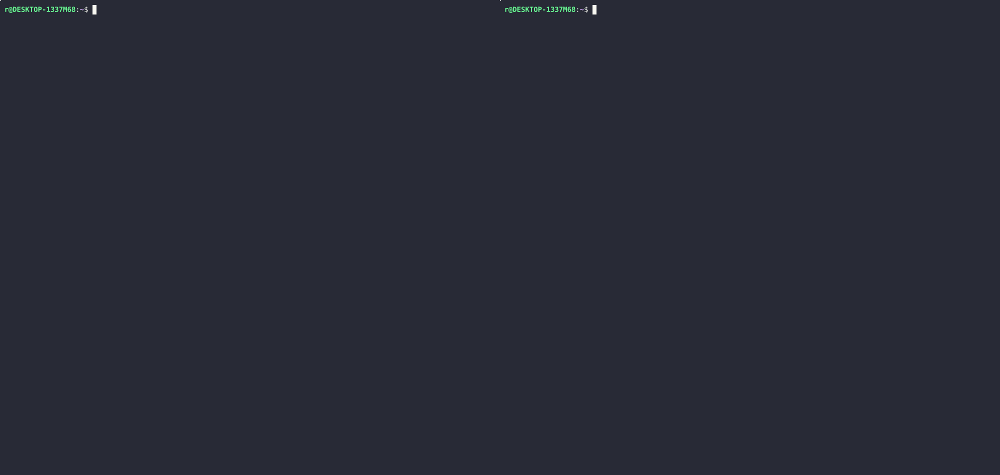

# Bash Enhancer

Tired of typing the same super-long commands/paths over and over again, have to pay super attention wich folder are you in, recursive bash history search feels slow and tiring? Look no further and forget these problems!

<p align="center" style="font-size:1.5em;">
    <b>Without Bash Enhancer</b> &nbsp;|&nbsp;<<< Same typing speed >>>&nbsp;|&nbsp; <b>With Bash Enhancer</b>
</p>
<p align="center">
    
</p>

> **Result:** Bash Enhancer reduces typing, eliminates repetitive navigation, and provides memorable, auto-completing shortcuts for common tasks.


A collection of helpful Bash aliases and functions to supercharge your terminal productivity. This script is designed to be sourced from your `.bashrc` or `.bash_profile` and provides convenient shortcuts for Git, Node.js, Rails, directory navigation, and more.

## Features

- **Let's Go: Directory Lookup Table Navigation (LUT)**: Jump to frequently used directories with auto-completion using the `lg` function.
- **Helper Functions**: Quickly list and describe all your aliases and functions.
- **System Aliases**: Common system commands for convenience.
- **Git Aliases**: Shortcuts for common Git operations, including branch management and code review.
- **Node.js/NPM Aliases**: Fast commands for building and installing Node.js projects.
- **Ruby/Rails Aliases**: Helpers for running RSpec and Rails tasks.
- **Service Aliases**: Start services like Elasticsearch and Sidekiq with a single command.
- **Project Functions**: Start Rails or Node.js servers in any project directory with a single command.
- **Kubernetes Aliases**: Speed up your Kubernetes workflow with handy shortcuts for common `kubectl` commands, such as listing pods, describing resources, viewing logs, and switching contexts.
- **Docker Aliases**: Speed up Docker workflows with shortcuts for common commands, such as listing containers and images, starting/stopping containers, removing unused resources, and viewing logs.

## Installation

### Simplified installation

1. **Run the following commands to clone Bash Enhancer and set it up:**
    ```bash
    git clone https://github.com/huszakricsi/bash_enhancer.git "$HOME/.bash_enhancer"
    bash ~/.bash_enhancer/setup.sh
    ```

2. **[Customize](#customization)**

### Detailed

1. **Copy or symlink `bash_enhancer.sh` into your home directory or a config folder.**
2. **Source it from your `.bashrc` or `.bash_profile`:**
   ```bash
   . /path/to/bash_enhancer.sh
   ```
3. **[Customize](#customization)**

## Commands & Aliases

| Group               | Name/Alias             | Command/Definition                                                                                                                                                                                                                                                                                                                                                                                                                                                                                    | Description                                                                                                                                                                                                                                                                                                                                                                                                                                                                                           |
|---------------------|------------------------|-------------------------------------------------------------------------------------------------------------------------------------------------------------------------------------------------------------------------------------------------------------------------------------------------------------------------------------------------------------------------------------------------------------------------------------------------------------------------------------------------------|-------------------------------------------------------------------------------------------------------------------------------------------------------------------------------------------------------------------------------------------------------------------------------------------------------------------------------------------------------------------------------------------------------------------------------------------------------------------------------------------------------|
| Help Functions      | h                      | Help function defined in ~/.bash_enhancer/helpers.sh                                                                                                                                                                                                                                                                                                                                                                                                                                                  | Outputs list of aliases and functions in a colorized Markdown table. Filter groups by adding it's prefix after the command(h sys - for example). If -g is passed, it outputs a list of groups and their aliases/functions.                                                                                                                                                                                                                                                                            |
| Help Functions      | hl                     | Help function defined in ~/.bash_enhancer/helpers.sh                                                                                                                                                                                                                                                                                                                                                                                                                                                  | List all aliases and functions in your .bash_enhancer/bash_enhancer.sh with their definitions                                                                                                                                                                                                                                                                                                                                                                                                         |
| System Aliases      | c                      | clear                                                                                                                                                                                                                                                                                                                                                                                                                                                                                                 | Clear the terminal screen                                                                                                                                                                                                                                                                                                                                                                                                                                                                             |
| System Aliases      | e                      | exit                                                                                                                                                                                                                                                                                                                                                                                                                                                                                                  | Exit the terminal                                                                                                                                                                                                                                                                                                                                                                                                                                                                                     |
| Apt-Get Aliases     | au                     | sudo apt-get update                                                                                                                                                                                                                                                                                                                                                                                                                                                                                   | Update package lists                                                                                                                                                                                                                                                                                                                                                                                                                                                                                  |
| Apt-Get Aliases     | ai                     | sudo apt-get install                                                                                                                                                                                                                                                                                                                                                                                                                                                                                  | Install a package using apt-get                                                                                                                                                                                                                                                                                                                                                                                                                                                                       |
| Apt-Get Aliases     | ar                     | sudo apt-get remove                                                                                                                                                                                                                                                                                                                                                                                                                                                                                   | Remove a package using apt-get                                                                                                                                                                                                                                                                                                                                                                                                                                                                        |
| Apt-Get Aliases     | as                     | sudo apt-get search                                                                                                                                                                                                                                                                                                                                                                                                                                                                                   | Search for a package using apt-get                                                                                                                                                                                                                                                                                                                                                                                                                                                                    |
| Apt-Get Aliases     | aug                    | sudo apt-get upgrade                                                                                                                                                                                                                                                                                                                                                                                                                                                                                  | Upgrade installed packages using apt-get                                                                                                                                                                                                                                                                                                                                                                                                                                                              |
| Apt-Get Aliases     | armo                   | sudo apt-get autoremove                                                                                                                                                                                                                                                                                                                                                                                                                                                                               | Remove unused packages using apt-get                                                                                                                                                                                                                                                                                                                                                                                                                                                                  |
| Git Aliases         | ga                     | Function (Use hl command to see definiton, or check ~/.bash_enhancer/bash_enhancer.sh)                                                                                                                                                                                                                                                                                                                                                                                                                | Git add command to stage changes                                                                                                                                                                                                                                                                                                                                                                                                                                                                      |
| Git Aliases         | gs                     | git status                                                                                                                                                                                                                                                                                                                                                                                                                                                                                            | Show the status of the Git repository                                                                                                                                                                                                                                                                                                                                                                                                                                                                 |
| Git Aliases         | gl                     | git for-each-ref --sort=committerdate refs/heads/ --format='%(HEAD) %(color:yellow)%(refname:short)%(color:reset) - %(color:red)%(objectname:short)%(color:reset) - %(contents:subject) - %(authorname) (%(color:green)%(committerdate:relative)%(color:reset))'                                                                                                                                                                                                                                      | Colorized, sorted list of local Git branches                                                                                                                                                                                                                                                                                                                                                                                                                                                          |
| Git Aliases         | gpl                    | git pull                                                                                                                                                                                                                                                                                                                                                                                                                                                                                              | Pull the latest changes from the remote repository                                                                                                                                                                                                                                                                                                                                                                                                                                                    |
| Git Aliases         | gps                    | git push                                                                                                                                                                                                                                                                                                                                                                                                                                                                                              | Push changes to the remote repository                                                                                                                                                                                                                                                                                                                                                                                                                                                                 |
| Git Aliases         | gf                     | git fetch                                                                                                                                                                                                                                                                                                                                                                                                                                                                                             | Fetch changes from the remote repository                                                                                                                                                                                                                                                                                                                                                                                                                                                              |
| Git Aliases         | gcan                   | git commit --amend --no-edit                                                                                                                                                                                                                                                                                                                                                                                                                                                                          | Amend the last commit without changing the commit message                                                                                                                                                                                                                                                                                                                                                                                                                                             |
| Git Aliases         | gcl                    | git clone $1                                                                                                                                                                                                                                                                                                                                                                                                                                                                                          | Clone a Git repository                                                                                                                                                                                                                                                                                                                                                                                                                                                                                |
| Git Aliases         | gco                    | Function (Use hl command to see definiton, or check ~/.bash_enhancer/bash_enhancer.sh)                                                                                                                                                                                                                                                                                                                                                                                                                | Checkout a specific branch or commit                                                                                                                                                                                                                                                                                                                                                                                                                                                                  |
| Git Aliases         | gcob                   | git checkout -b $1                                                                                                                                                                                                                                                                                                                                                                                                                                                                                    | Create a new branch and switch to it                                                                                                                                                                                                                                                                                                                                                                                                                                                                  |
| Git Aliases         | gcoh                   | Function (Use hl command to see definiton, or check ~/.bash_enhancer/bash_enhancer.sh)                                                                                                                                                                                                                                                                                                                                                                                                                | Show Git checkout history                                                                                                                                                                                                                                                                                                                                                                                                                                                                             |
| Git Aliases         | gcm                    | git commit -m $1                                                                                                                                                                                                                                                                                                                                                                                                                                                                                      | Commit changes with a message                                                                                                                                                                                                                                                                                                                                                                                                                                                                         |
| Git Aliases         | gst                    | git stash                                                                                                                                                                                                                                                                                                                                                                                                                                                                                             | Stash changes in the working directory                                                                                                                                                                                                                                                                                                                                                                                                                                                                |
| Git Aliases         | gstp                   | git stash pop                                                                                                                                                                                                                                                                                                                                                                                                                                                                                         | Apply the most recent stash                                                                                                                                                                                                                                                                                                                                                                                                                                                                           |
| Git Aliases         | gcfd                   | git clean -fd                                                                                                                                                                                                                                                                                                                                                                                                                                                                                         | Discard untracked files                                                                                                                                                                                                                                                                                                                                                                                                                                                                               |
| Git Aliases         | grh                    | git reset --hard                                                                                                                                                                                                                                                                                                                                                                                                                                                                                      | Discard all changes in the working directory                                                                                                                                                                                                                                                                                                                                                                                                                                                          |
| Git Aliases         | grhh                   | git reset --hard HEAD && git clean -fd                                                                                                                                                                                                                                                                                                                                                                                                                                                                | Discard all changes, including untracked files and directories                                                                                                                                                                                                                                                                                                                                                                                                                                        |
| Docker Aliases      | dc                     | docker compose                                                                                                                                                                                                                                                                                                                                                                                                                                                                                        | Docker Compose command                                                                                                                                                                                                                                                                                                                                                                                                                                                                                |
| Docker Aliases      | dcr                    | docker compose run                                                                                                                                                                                                                                                                                                                                                                                                                                                                                    | Run a one-off command in a new container using docker compose                                                                                                                                                                                                                                                                                                                                                                                                                                         |
| Docker Aliases      | dcu                    | docker compose up                                                                                                                                                                                                                                                                                                                                                                                                                                                                                     | Start up docker compose services                                                                                                                                                                                                                                                                                                                                                                                                                                                                      |
| Docker Aliases      | dce                    | docker compose exec                                                                                                                                                                                                                                                                                                                                                                                                                                                                                   | Execute a command in a running docker compose service                                                                                                                                                                                                                                                                                                                                                                                                                                                 |
| Docker Aliases      | dcd                    | docker compose down                                                                                                                                                                                                                                                                                                                                                                                                                                                                                   | Stop and remove docker compose containers, networks, images, and volumes                                                                                                                                                                                                                                                                                                                                                                                                                              |
| Docker Aliases      | dce                    | docker compose exec -it                                                                                                                                                                                                                                                                                                                                                                                                                                                                               | Execute a command interactively in a running docker compose service                                                                                                                                                                                                                                                                                                                                                                                                                                   |
| Docker Aliases      | dcrec                  | docker compose down && docker system prune -a && docker network create shared_network && docker compose up                                                                                                                                                                                                                                                                                                                                                                                            | Recreate docker environment: stop, prune, create network, and start up                                                                                                                                                                                                                                                                                                                                                                                                                                |
| Kubernetes Aliases  | kdd                    | kubectl describe deployment                                                                                                                                                                                                                                                                                                                                                                                                                                                                           | Describe a Kubernetes deployment                                                                                                                                                                                                                                                                                                                                                                                                                                                                      |
| Kubernetes Aliases  | kdp                    | kubectl describe pod                                                                                                                                                                                                                                                                                                                                                                                                                                                                                  | Describe a Kubernetes pod                                                                                                                                                                                                                                                                                                                                                                                                                                                                             |
| Kubernetes Aliases  | kds                    | kubectl describe service                                                                                                                                                                                                                                                                                                                                                                                                                                                                              | Describe a Kubernetes service                                                                                                                                                                                                                                                                                                                                                                                                                                                                         |
| Kubernetes Aliases  | kdre                   | kubectl describe replica                                                                                                                                                                                                                                                                                                                                                                                                                                                                              | Describe a Kubernetes replica set                                                                                                                                                                                                                                                                                                                                                                                                                                                                     |
| Kubernetes Aliases  | kdc                    | kubectl describe configmap                                                                                                                                                                                                                                                                                                                                                                                                                                                                            | Describe a Kubernetes config map                                                                                                                                                                                                                                                                                                                                                                                                                                                                      |
| Kubernetes Aliases  | kdrs                   | kubectl describe rs                                                                                                                                                                                                                                                                                                                                                                                                                                                                                   | Describe a Kubernetes replication controller                                                                                                                                                                                                                                                                                                                                                                                                                                                          |
| Node.js/NPM Aliases | nrb                    | npm run build                                                                                                                                                                                                                                                                                                                                                                                                                                                                                         | Run the Node.js build script                                                                                                                                                                                                                                                                                                                                                                                                                                                                          |
| Node.js/NPM Aliases | ni                     | npm install                                                                                                                                                                                                                                                                                                                                                                                                                                                                                           | Install Node.js dependencies                                                                                                                                                                                                                                                                                                                                                                                                                                                                          |
| Ruby/Rails Aliases  | rsp                    | bundle exec rescue rspec --fail-fast                                                                                                                                                                                                                                                                                                                                                                                                                                                                  | Run RSpec tests with Rescue                                                                                                                                                                                                                                                                                                                                                                                                                                                                           |
| Service Aliases     | elasticsearch          | /usr/share/elasticsearch/bin/elasticsearch                                                                                                                                                                                                                                                                                                                                                                                                                                                            | Start the Elasticsearch service                                                                                                                                                                                                                                                                                                                                                                                                                                                                       |
| Service Aliases     | sidekiq                | redis-cli FLUSHALL & bundle exec sidekiq                                                                                                                                                                                                                                                                                                                                                                                                                                                              | Start the Sidekiq background job processor                                                                                                                                                                                                                                                                                                                                                                                                                                                            |
| Let's Go navigation | lg                     | Function (Use hl command to see definiton, or check ~/.bash_enhancer/bash_enhancer.sh)                                                                                                                                                                                                                                                                                                                                                                                                                | (Let's Go) Change to the specified directory from LUT, with auto-completion. Use -l to list all LUT keys and paths.                                                                                                                                                                                                                                                                                                                                                                                   |
| LS Functions        | ll                     | ls -alF                                                                                                                                                                                                                                                                                                                                                                                                                                                                                               | List files in long format, including hidden files                                                                                                                                                                                                                                                                                                                                                                                                                                                     |
| LS Functions        | la                     | ls -A                                                                                                                                                                                                                                                                                                                                                                                                                                                                                                 | List all files, including hidden files, but not '.' and '..'                                                                                                                                                                                                                                                                                                                                                                                                                                          |
| LS Functions        | l                      | ls -CF                                                                                                                                                                                                                                                                                                                                                                                                                                                                                                | List files in columns, appending a slash to directories                                                                                                                                                                                                                                                                                                                                                                                                                                               |
| Project Functions   | rs                     | Function (Use hl command to see definiton, or check ~/.bash_enhancer/bash_enhancer.sh)                                                                                                                                                                                                                                                                                                                                                                                                                | Run the Rails server in the specified directory from LUT, with auto-completion, if no directory is specified, it defaults to the current directory.                                                                                                                                                                                                                                                                                                                                                   |
| Project Functions   | rc                     | Function (Use hl command to see definiton, or check ~/.bash_enhancer/bash_enhancer.sh)                                                                                                                                                                                                                                                                                                                                                                                                                | Run the Rails console in the specified directory from LUT, with auto-completion, if no directory is specified, it defaults to the current directory.                                                                                                                                                                                                                                                                                                                                                  |
| Project Functions   | bi                     | Function (Use hl command to see definiton, or check ~/.bash_enhancer/bash_enhancer.sh)                                                                                                                                                                                                                                                                                                                                                                                                                | Runs bundle install in the specified directory from LUT, with auto-completion. If no directory is specified, it defaults to the current directory.                                                                                                                                                                                                                                                                                                                                                    |
| Project Functions   | rk                     | Function (Use hl command to see definiton, or check ~/.bash_enhancer/bash_enhancer.sh)                                                                                                                                                                                                                                                                                                                                                                                                                | Run the specified Rake Task. If two parameters are given, change to the directory from LUT using the first parameter, then use the second as an argument to rake.                                                                                                                                                                                                                                                                                                                                     |
| Project Functions   | nrd                    | Function (Use hl command to see definiton, or check ~/.bash_enhancer/bash_enhancer.sh)                                                                                                                                                                                                                                                                                                                                                                                                                | Run the Node.js development server in the specified directory from LUT, with auto-completion. If no directory is specified, it defaults to the current directory.                                                                                                                                                                                                                                                                                                                                     |
| Project Functions   | nrd-dependency-refresh | Function (Use hl command to see definiton, or check ~/.bash_enhancer/bash_enhancer.sh)                                                                                                                                                                                                                                                                                                                                                                                                                | Refresh the Node.js development server for the given project, and also rebuild the "dependency" project. Works with auto-completion. Feel free to tailor as you it to your needs                                                                                                                                                                                                                                                                                                                      |

## Let's Go: Directory Lookup Table Navigation (LUT)

- The LUT is defined in `dir_lut.sh` (or falls back to `dir_lut.sh.example`).
- Add entries like:
  ```bash
  [alfa]="$HOME/projects/client_a/alfa_project"
  ```
- Use `lg alfa` to jump to that directory. Don't forget that you dont have to type the whole key, use **tab** for auto-completion.
- Use the switch **-l** to list all LUT keys and paths.
  
## Project Application Executing and Building Functions with Let's Go:

- **Rails Server (`rs`)**  
  ```bash
  rs my_project
  ```
  *Jumps to the directory mapped to `my_project` in your LUT and starts the Rails server (`bundle exec rails s`).*

- **Rails Console (`rc`)**  
  ```bash
  rc my_project
  ```
  *Jumps to the directory mapped to `my_project` in your LUT and opens the Rails console (`bundle exec rails c`).*

- **Rake Task (`rk`)**  
  ```bash
  rk db:migrate my_project
  ```
  *Jumps to the directory mapped to `my_project` in your LUT and runs `bundle exec rake db:migrate`. If only a task is given, runs it in the current directory.*

- **Node.js Dev Server (`nrd`)**  
  ```bash
  nrd frontend
  ```
  *Jumps to the directory mapped to `frontend` in your LUT and starts the Node.js dev server (`npm run dev`).*

- **Node.js Library Refresh (`nrd-library-refresh`)**  
  ```bash
  nrd-library-refresh frontend
  ```
  *Jumps to the directory mapped to `frontend` in your LUT, rebuilds the dependency library, removes and reinstalls `node_modules`, and restarts the dev server. Useful for frontend projects with shared dependencies that you want to work on.*

## Requirements

- Bash 4+
- Perl (for the `h` (help) function)
- awk, grep, git, npm, bundle, rails, etc. (as needed by your workflow)

## Customization

- Edit `bash_enhancer.sh` to add or modify aliases and functions. **\[Optional\]**
- **Customize your directory lookup table:**
   - Copy `dir_lut.sh.example` to `dir_lut.sh` in the same directory. 
        ```bash
        cp ~/.bash_enhancer/dir_lut.sh.example ~/.bash_enhancer/dir_lut.sh
        ```
   - Edit `dir_lut.sh` to add your own directory shortcuts, with your chosen editor:
        ```bash
        nano ~/.bash_enhancer/dir_lut.sh
        ```
        ```bash
        vim ~/.bash_enhancer/dir_lut.sh
        ```
        ```bash
        code ~/.bash_enhancer/dir_lut.sh
        ```
